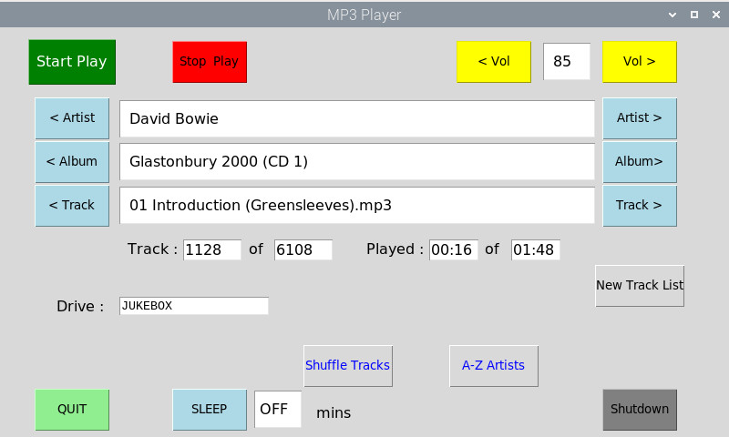

# Pi-MP3_Player
Pi-MP3_Player

Designed to be used with a Pi and the Pi 7" Touchscreen LCD.

(Using a PC display may not put all the displayed items in the correct places, I don't know why)

Tested on Pi 2 v1.1 and Pi 4, using Buster.

## LCD Screenshot

I use the analog audio output on the 3.5" 4way socket. Bluetooth may work BUT I found it kept dropping out.

The playlist is stored in /home/pi/Queue.txt with the following format...

Who^The Very Best of the Who^01 I Can't Explain.mp3^8A51-08B8

Who^The Very Best of the Who^02 Anyway, Anyhow, Anywhere.mp3^8A51-08B8

Who^The Very Best of the Who^03 My Generation.mp3^8A51-08B8

Who^The Very Best of the Who^04 Substitute.mp3^8A51-08B8

Who^The Very Best of the Who^05 I'm a Boy.mp3^8A51-08B8

Who^The Very Best of the Who^06 Boris the Spider.mp3^8A51-08B8

in this case 8A51-08B8 is the name of the USB stick. Listed by Artist name^Album name^Track name^Drive name Note the use of ^ as a seperator as , can be in Track names.

On the USB sticks the format must be /Artist Name/Album Name/Track Name 
so in File Manager you will see the Tracks under
/media/pi/8A51-08B8/Who/The Very Best of the Who/

If you don't have a /home/pi/Queue.txt file when you start the script it will generate one from the tracks it finds on the USB stick(s).
Clicking on New Track List will make a new list from the USB stick(s).

You can Play or Stop Tracks (remember to Stop BEFORE closing the script or click QUIT or SHUTDOWN ), Shuffle the tracks, Restore to original A-Z Artist track order, switch to next / previous Artist, Album or Track.
Clicking A-Z Artist track after the initial sort will step through the artists from A to Z, showing the first one for each letter. To select others with the same starting letter use NEXT ARTIST.

You can also set a SLEEP period and the pi will shutdown after that, or SHUTDOWN will shutdown immediately.

You'll need to run...

sudo apt-get install python3-alsaaudio

sudo apt-get install mplayer

sudo pip3 install mutagen

On the Pi right click on the Task Bar, choose Panel Settings, choose Advanced, tick Minimize panel when not in use, click Close.

To get the script to run at boot, assuming you are booting to the GUI

add the following line to /etc/xdg/lxsession/LXDE-pi/autostart

@/usr/bin/python3 /home/pi/MP3_player.py 

(NOTE: assuming you saved the script as MP3_player.py in /home/pi/)
