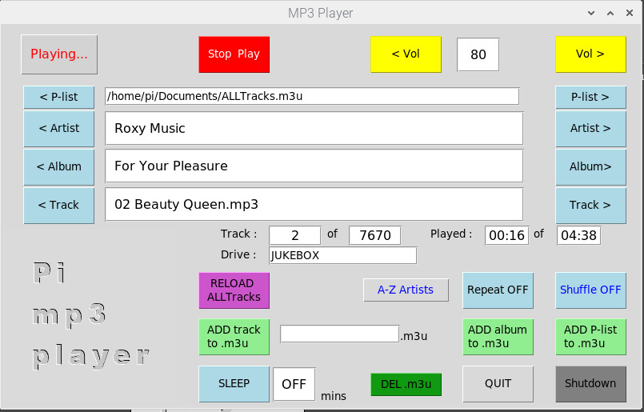

# Pi-MP3_Player
Pi-MP3_Player

Designed to be used with a Pi and the Pi 7" Touchscreen LCD, but will work on other monitors. Playing tracks from USB sticks (or HDD) under /media/pi/usb_stick_name/artist name/album_name/tracks.

You could put mp3 files on the SD card under /media/pi/, just make a directory there eg. /media/pi/MUSIC/ and put the mp3s in an appropriate directory eg. /media/pi/MUSIC/Rolling Stones/Exile on Mainstreet/

All directories, default playlist name etc are definable in the script.

Tested on Pi 2 v1.1 and Pi 4, using Buster.

New features.

- New 'wheel' added which will allow you to step through P-List, Artist, Album or Track. Rotate on it either clockwise or anti-clockwise. Choice of P-List, Artist, Album or Track selected by clicking the centre button, which will highlight the choice set in red. The 'wheel' will skip forwards / backwards (in 10 second steps), and the centre button will MUTE/UNMUTE, whilst playing tracks (assuming GAPLESS is not ON!).

- A-Z Sort can now order by Artist, Album or Track.

- Changed clicking on Sleep time to CANCEL SLEEP. Max sleep time now 999 minutes.

- Play Album added. Choose your album and click 'Play Album', this will play the album and then stop. Set SLEEP to shutdown after album played.

- Pause OR Gapless. Gapless is used for live albums where you don't want a gap between tracks. It starts the next track BEFORE the previous tracks end to ensure no gap. Currently set for a 2 second overlap. Pause and Gapless cannot be used together.

- clicking on the volume value will MUTE the output, click again to UNMUTE.

- Album or Track titles > 50 chars will scroll.

- Adds a display of Playlist time, and time left to play (upto 120 minutes).

- Optional external volume UP/DOWN and START/STOP switches, on GPIO 36,38 & 40. switches to gnd to operate.

- 'ADD artist to .m3u' will make a m3u file with all tracks by a selected artist.

## LCD Screenshot

I use the analog audio output on the 3.5mm 4way socket. Bluetooth may work BUT I found it kept dropping out.

The default playlist is stored in /home/pi/Documents/ALLTracks.m3u with the following format...

/media/pi/JUKEBOX/Roxy Music/For Your Pleasure/01 Do The Strand.mp3

/media/pi/JUKEBOX/Roxy Music/For Your Pleasure/02 Beauty Queen.mp3

in this case JUKEBOX is the name of the USB stick. 

On the USB sticks the format must be /Artist Name/Album Name/Track Name 
so in File Manager you will see the Tracks...

## File structure Screenshot

If you don't have a /home/pi/Documents/ALLTracks.m3u file when you start the script it will generate one from the tracks it finds on the USB stick(s).

You can put, or use the script to generate, other .m3u files in the /home/pi/Documents/ directory and they can be accessed using the P-List buttons.
Remember to include the full path to the tracks in them.

Clicking on 'RELOAD ALLTracks' will make a new ALLTracks.m3u playlist from the USB stick(s). Use this if you add or remove tracks to/from the USB stick, or insert another USB stick.

You can PLAY, PAUSE or STOP Tracks (remember to Stop BEFORE closing the script or click QUIT or SHUTDOWN ), Shuffle ON/OFF, Repeat ON/OFF, Change to A-Z Artist/Album/Track track order, switch to next / previous Artist, Album or Track.

'Repeat ON' will constant repeat the playlist.

Clicking 'next A-Z' will step through the artists/albums/tracks from A to Z, showing the first one for each letter. To select other Artists/Albums/Tracks with the same starting letter use ARTIST/ALBUM/TRACK >.

You can also generate .m3u files. Choose the artist, album or track from ALLTracks.m3u ( or other m3u playlist when you have more), enter a name for the .m3u list (if you don't it will make a name based on date & time), then press either 'ADD track to .m3u' , 'ADD album to .m3u' or 'ADD artist to .m3u'. Repeat process to add more tracks, albums or artists. Click 'STOP' to clear .m3u field. You can now access the new playlist with the P-list buttons. 

'ADD P-List to .m3u' will allow you to make larger .m3us from other m3us, or you can DELETE a .m3u file, enter the name and press the 'DEL .m3u' button. Note you CANNOT DELETE the ALLTrack.m3u or ADD it to another list.

You can also set a SLEEP period and the pi will shutdown after that, or SHUTDOWN will shutdown immediately.

You can add images of the album covers in the album directories for displaying, name ending in .jpg MAX size 218 x 218 pixels.

==========================================================================

To install copy MP3_Player.py and mp3.jpg to /home/pi/ and then run...

sudo apt-get install python3-alsaaudio

sudo apt-get install mplayer

sudo pip3 install mutagen

sudo pip3 install mplayer.py

To run python3 MP3_Player.py

To get the script to run at boot, assuming you are booting to the GUI

add the following line to /etc/xdg/lxsession/LXDE-pi/autostart

@/usr/bin/python3 /home/pi/MP3_player.py 

(NOTE: assuming you saved the script as MP3_player.py in /home/pi/)
