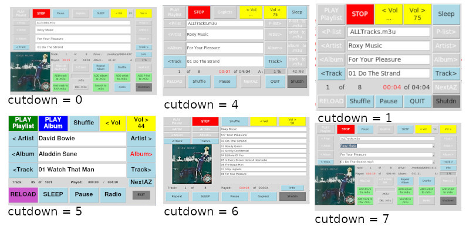
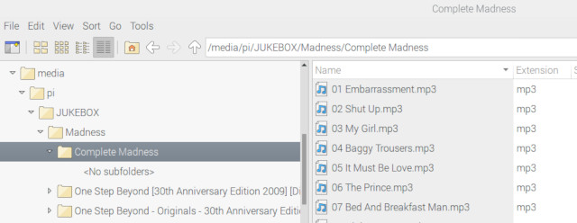

# Pi-MP3 and Radio Stream Player
Pi-MP3_Player

Note this will work under BUSTER, BULLSEYE , OR BOOKWORM 

v17.85 Bluetooth IN. Pair your cell phone etc with the Pi. Run MP3_Player.py, click on Bluebooth ,
reconnect your cell phone, play your music on your cell phone. click on Bluetooth button to stop.

v17.80 version notes:

    Set Variable rotary = 1 (line 31), set to 0 if you want to use the
    original external buttons.
    
    Rotary Encoder 1 (KY-040) will set volume, it's press button will MUTE
    
    Rotary Encoder 2 (KY-040) will step through the onscreen buttons,
    press (goes red) and select Plist/Artist/Album/Track
    press again (goes yellow) and 
    choose Play Playlist / Play Album and press again.
    Will step through tracks whilst playing an Album. 

    see rotary_connections.jpg 

    I would recommend cutdowns 0 or 5 with the rotary encoders.
    7 has the drop downs which are no use with the rotary encoders 
    and slow the system down, 0 is quicker and has the same options.

    Note:-
    Pressing RELOAD / Radio may take a while before you see anything happening.
    Don't be tempted to press any screen buttons if using the rotary encoders,
    this will confuse the code !!
    Don't set rotary = 0 if you have the rotarys connected.

Note tested on a Pi5 with bookworm but not with the PI 7" screens.

Designed to be used with a Pi and the Pi 7" Touchscreen LCD, but will work on other monitors. Playing .mp3, .flac, .wav, .dsf, .m4a tracks from USB sticks (or HDD) under /media/pi/usb_stick_name/artist name/album_name/tracks.

You could put MP3 track files on the SD card under /home/USERNAME/Music, and put the tracks in an appropriate directory eg. /home/USERNAME/Music/Rolling Stones/Exile on Mainstreet/. NOTE MP3 ONLY (and your username may not be pi).

Default playlist name etc are definable in the script.
Avoid any directory/track names with [ ] (square brackets) in.

Tested on Pi 2 v1.1, 3A, 3B, 4B, Zero W, v1.2 & v1.3 , Pi400 and Pi4 with  32 and 64bit Pi OS, all using Buster.
Also tested on a Pi4 4GB using FULL 32bit and 64bit BULLSEYE & BOOKWORM

For Radio Stream use Pi3, Pi4, Pi5 or Pi400 recommended as it requires RAM space.

See installation_instructions.txt for how to install and run.

## LCD Screenshots

# To install 

Download the Zip, Extract, and copy MP3_Player.py, mp3c.py and mp3.jpg to /home/USERNAME/

and then run...

sudo apt-get install python3-alsaaudio

sudo apt-get install mplayer

sudo pip3 install mutagen (with BOOKWORM add --break-system-packages)

sudo pip3 install mplayer.py (with BOOKWORM add --break-system-packages)

sudo apt-get install streamripper

sudo apt-get install python3-pil.imagetk

sudo pip3 install rpi_backlight  (with BOOKWORM add --break-system-packages)

To run python3 MP3_Player.py

To run at boot (assuming booting to GUI) if using Buster, Bullseye or Bookworm using X11. ..

add @/usr/bin/python3 /home/pi/MP3_Player.py to the end of /etc/xdg/lxsession/LXDE-pi/autostart

( replace pi with your login username)

- Can be configured to boot to PLAY, PLAY ALBUM, RADIO or RADIO RECORD.

- For boot to Play         : Choose track, Click on SHUFFLE if required, then press PLAY PLAYLIST, then SHUTDOWN. 
- For boot to Play ALBUM   : Choose track, then press PLAY ALBUM, then SHUTDOWN.
- For boot to Radio        : Choose Radio Station then press SHUTDOWN.

  to EXIT script without shutting down, right click on shutdown..
  
# File structure

On the USB sticks the format must be /Artist Name/Album Name/Track Name 
so in File Manager you will see the Tracks...

Note that my USB stick was called JUKEBOX but maybe called something like 0845-A56E or 31 GB Volume, there is no need to name / rename it.

You can add images of the album covers in the album directories for displaying, name ending in .jpg MAX size 218 x 218 pixels.

## File structure Screenshot

# New features

- To exit without shutting down right mouse click on shutdown
- radio recording time increased, and proportional to amount of ram if self.max_record set to 0.

- cutdown 5 album cover and Radio Station logo image display added
- cutdown 5 larger font
- album cover images shown on cutdown 1 & 4
- fix to Radio track titles

- .wav playing added

- Additional Audio file formats added, DSD (.dsf) and ALAC (.m4a). Note some features not available with these.

- Skip Fwd button added. With skip forward 10% of track length, useful for long tracks.

- Radio stations can be added in a file called /home/pi/radio_stns.txt (saves typing them in again on new versions).
  format: Name,URL,Recordable on each line (no " " around names / URLs)

- cutdown 7 added, providing lookups for artists (radio stations), albums and tracks.

- support for Pi-DAC pro added.

- cutdown = 6 added:-

- Lists 10 album / playlist tracks, which can be clicked on to play.

- Lists first 9 Radio Stations form list, which can be clicked on to play.

- Info button will list album tracks, or tracks from radio recording if they were available in the stream.

- Radio Use -

- Progress bar implemented during Radio Recording. Info button (cutdown = 0 only) shows playlist (if available in stream) during recording.

- Will now display track names on playing back recorded radio, if they were available in the stream. 
 The playlist can be shown by pressing INFO button. Note this will not work if you already have a file named "info", "md5" or "ffp".

You could also add track names to other tracks, for example a recorded session with multiple tracks, by adding a .txt file in the album directory
with the same name as the track.  

Format: Track start time text

000:01 Introduction

001:50 Track Name 1

006:23 Track Name 2

- Radio use:
  - Artist & Track Name shown, if available in stream, when listening / recording.
  - Will record to end of track, if Track Name in stream. (-ve times shown)
  - Will stop recording if low amount RAM available.
  - 'CLR RAM' will remove old recordings from RAM.
  - 'SLEEP' will STOP Radio, but not shutdown , or you will lose recording from RAM.
  - On 'STOP RECORD' or Record Timer expiring it will switch to MP3 Player showing the Radio Recording for playing.
 
- Volume stored in config file

- Time shift streaming Radio channel. If you are listening to a programme and need to do something else you can click on 'RECORD', set the time required in ten 
  minute steps by clicking on 'RECORD', and leave it. (You can now mute the sound if required) .
  You can name the recording by entering the name before clicking 'RECORD' on cutdown = 0 option.
  
  NOTE: It will NOT play all types of stream, MP3 and Flacs are normally OK. It will NOT record all types of stream, MP3s are OK. 
  In the script you can identify which ones are recordable by setting to 1.
  
  eg. "JB Radio-2 (320)","http://cristina.torontocast.com:8007/mp3-320",1,
  
  It will record this to RAM and on return you can listen to it by Stopping Radio (or STOP RECORD at any time) and 'PLAY ALBUM' to playback the recording.
  Note this recording will ONLY be available in the playlist whilst the Pi is powered. 
  Install streamripper with sudo apt install streamripper, and copy radio.jpg to /home/pi/

- Info button added. Will read and display an 'info.txt' file in an album directory. ONLY on cutdown = 0 screen (default).
  Change 'self.Button_info_on = 0' to disable.

- Support for .flacs added

- 'Radio' button added for playing radio streams. Edit self.Radio_Stns = [  ] to add / remove stations. Format is "Name1","URL1","Name2","URL2",...
  If you want an image displayed for the Radio Station place the .jpg file in /home/pi/Documents. jpg filename must be 'Name1.jpg' to match the station name.

- The 'Wheel' has an option to step through Artists by A to Z. Click on the 'Wheel Centre Button' until 'NextA-Z' turns red, then use the 'Wheel' to select.
  Click on 'Wheel Centre Button' again to turn 'Artist' red and use the 'Wheel', or the 'Artist' buttons, to select the artist.

- CD sets, eg 2 CDs, can be treated as 1 album. Ensure the albums are named the same except for the last character eg.
  'The Best of - CD1' and 'The Best of - CD2'. When 'Album Play' is clicked it will play both as 1 album.
  Creating a .m3u by clicking 'ADD Album to .m3u' will also include both.
  
- SLEEP. Selecting SLEEP during Album Play will initially set the album time, subsequent clicks will set a time in 15 minutes steps.

- Cutdown option 5 for 800x480 (SIMPLE LAYOUT, only default Playlist)

- Cutdown option 4 for Waveshare 2.8" LCD https://thepihut.com/collections/raspberry-pi-screens/products/spi-2-8-320x240-touch-screen-gpio

  Note although this screen is 320x240 it works at 480x320 with Raspberry OS.
  
  KEY1 - Vol UP, KEY2 - VOL DN, KEY3 - MUTE, KEY4- STOP

- Cutdown option for 800 x 480, 320 x 240, 640 x 480 or 480 x 800 screen. Set variable cutdown = 0,1,2 or 3 in script

- 'Add artist to .m3u' will generate a .m3u file with the artists name, if no name specified.

- Bluetooth audio now supported. Note limitations no pause, no gapless and limited wheel.

- Playlists can be generated using a word in the track names. Enter a word in the .m3u box and click 'Search to .m3u', this will make a m3u with all tracks with that word in the title, and switch to it.

- to DELETE a .m3u enter the name in the .m3u field and click DEL .m3u. 
  If you don't have a keyboard then choose the P-List, then set the Vol to 0, (click button between < Vol and Vol >),  and then click DEL .m3u.

- gpio_enable added to allow the external gpio switches to be disabled if using a HyperPixel4 display, as it upsets the colours. Should automatically detect HyperPixel4 LCD

-  % Progress Bar added (Load/Track/Album/Playlist), Searches more directories, including /media/pi/Music, .jpgs automatically sized.

- 'Add Track to FAV .m3u' button added to make your Favourite Tracks playlist

- 'ALBUM Repeat' and 'ALBUM shuffle' added

- Next / Prev Track enabled during ALBUM play

- New 'wheel' added which will allow you to step through P-List, Artist, Album or Track. Rotate on it either clockwise or anti-clockwise. Choice of P-List, Artist, Album or Track selected by clicking the centre button, which will highlight the choice set in red. The 'wheel' will skip forwards / backwards (in 10 second steps), and the centre button will MUTE/UNMUTE, whilst playing tracks (assuming GAPLESS is not activated).

- A-Z Sort can now order by Artist, Album or Track.

- Changed clicking on Sleep time to CANCEL SLEEP. Max sleep time now 999 minutes.

- Play Album added. Choose your album and click 'Play Album', this will play the album and then stop. Set SLEEP to shutdown after album played.

- Pause OR Gapless. Gapless is used for live albums where you don't want a gap between tracks. It starts the next track BEFORE the previous tracks end to ensure no gap. Currently set for a 2 second overlap. Pause and Gapless cannot be used together.

- clicking on the volume value will MUTE the output, click again to UNMUTE.

- Album or Track titles > 50 chars will scroll.

- Adds a display of Playlist time, and time left to play (upto 120 minutes).

- Optional external volume UP/DOWN/MUTE switches, on GPIO 16,12 & 13. Play gpio 5, play album gpio 6 ,switches to gnd to operate.

- 'ADD artist to .m3u' will make a m3u file with all tracks by a selected artist.

I use the analog audio output on the 3.5mm 4way socket. Bluetooth may work BUT I found it kept dropping out.

The default playlist is stored in /home/pi/Documents/ALLTracks.m3u with the following format...

/media/pi/JUKEBOX/Roxy Music/For Your Pleasure/01 Do The Strand.mp3

/media/pi/JUKEBOX/Roxy Music/For Your Pleasure/02 Beauty Queen.mp3

in this case JUKEBOX is the name of the USB stick. 

If you don't have a /home/pi/Documents/ALLTracks.m3u file when you start the script it will generate one from the tracks it finds on the USB stick(s).

You can put, or use the script to generate, other .m3u files in the /home/pi/Documents/ directory and they can be accessed using the P-List buttons.
Remember to include the full path to the tracks in them.

Clicking on 'RELOAD ALLTracks' will make a new ALLTracks.m3u playlist from the USB stick(s). Use this if you add or remove tracks to/from the USB stick, or insert another USB stick.

You can PLAY, PAUSE or STOP Tracks (remember to Stop BEFORE closing the script or click QUIT or SHUTDOWN ), Shuffle ON/OFF, Repeat ON/OFF, Change to A-Z Artist/Album/Track track order, switch to next / previous Artist, Album or Track.

'Repeat ON' will constant repeat the playlist.

Clicking 'next A-Z' will step through the artists/albums/tracks from A to Z, showing the first one for each letter. To select other Artists/Albums/Tracks with the same starting letter use ARTIST/ALBUM/TRACK >.

You can also generate .m3u files. Choose the artist, album or track from ALLTracks.m3u ( or other m3u playlist when you have more), enter a name for the .m3u list (if you don't it will make a name based on date & time), then press either 'ADD track to .m3u' , 'ADD album to .m3u' or 'ADD artist to .m3u'. Repeat process to add more tracks, albums or artists. Click 'STOP' to clear .m3u field. You can now access the new playlist with the P-list buttons. 

'ADD P-List to .m3u' will allow you to make larger .m3us from other m3us, or you can DELETE a .m3u file, enter the name and press the 'DEL .m3u' button. Note you CANNOT DELETE the ALLTrack.m3u or ADD it to another list.

You can also set a SLEEP period and the pi will shutdown after that, or SHUTDOWN will shutdown immediately, unless you are recording Radio.

You can add images of the album covers in the album directories for displaying, name ending in .jpg MAX size 218 x 218 pixels.

You can add images of the Radio Stations in /home/pi/Documents for displaying, name ending in .jpg MAX size 218 x 218 pixels.

==========================================================================

To install Download the Zip, Extract, and copy MP3_Player.py, mp3c.py and mp3.jpg to /home/pi/ 

and then run...

sudo apt-get install python3-alsaaudio

sudo apt-get install mplayer

sudo pip3 install mutagen

sudo pip3 install mplayer.py

sudo apt-get install streamripper

If you see ImportError: cannot import name 'ImageTk' from 'PIL' (/usr/lib/python3/dist-packages/PIL/__init__.py)

then sudo apt-get install python3-pil.imagetk

To run python3 MP3_Player.py

To get the script to run at boot, assuming you are booting to the GUI

add the following line to /etc/xdg/lxsession/LXDE-pi/autostart

@/home/pi/myscript.sh

and make a file called myscript.sh containing

#!/bin/bash
sleep 10
/usr/bin/python3 /home/pi/MP3_Player.py

and make it executable with  sudo chmod +x myscript.sh

